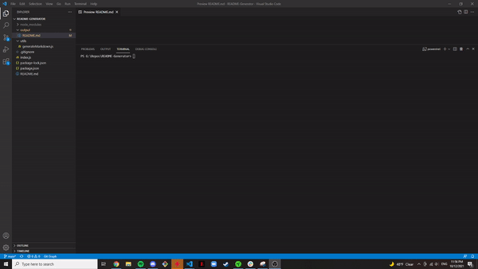

# README-Generator

## Table of Contents

- [README-Generator](#readme-generator)
  - [Table of Contents](#table-of-contents)
  - [Description](#description)
  - [Installation](#installation)
  - [Usage](#usage)
  - [Built With](#built-with)
  - [Technologies Used](#technologies-used)
  - [Contributing](#contributing)
  - [License](#license)
  - [Questions](#questions)
  

## Description

A rudimentary README generator. Exploring Node.js and npm.

  

**See this unique experience in action!**

## Installation

1. [Install Node.js](https://nodejs.org/en/download/) 

2. Install Inquirer JavaScript package

        npm install inquirer

## Usage

        node index.js

Find generated README in the output directory

## Built With

* [JavaScript](https://developer.mozilla.org/en-US/docs/Web/JavaScript)
* [Node.js](https://nodejs.org/en/)
* [Inquirer](https://www.npmjs.com/package/inquirer)

## Technologies Used

* [Microsoft Visual Studio Code](https://code.visualstudio.com/)
* [Git Bash](https://git-scm.com/downloads)
* [GitHub](https://github.com/)

## Contributing

**Henry Kam**

- [Github](https://github.com/gulpinhenry)
- [LinkedIn](https://www.linkedin.com/in/kamhenry/)

## License

This application is covered under the MIT license

## Questions

For any questions, please reach out by creating an issue.
